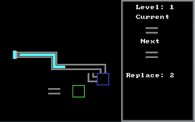
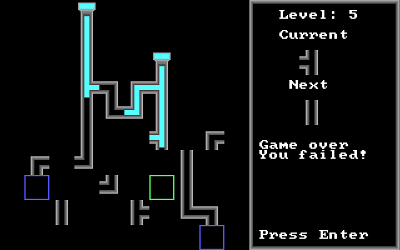

Pipeman 16-bit DOS game in COM executable format, developed on FreePascal and assembler.\
Игра Водопроводчик для 16-битных DOS-систем в формате COM, разработанная на FreePascal с ассемблерными вставками.

 

Для сборки используется кросс-компилятор FreePascalCompiler 3.0.4 для реального режима
MS-DOS и линкер OpenWatcom (скрипты сборки находятся в каталоге `build`,
написаны для Windows и Linux). Проект создан в объектно-ориентированной парадигме,
содержит 8 уровней игры и собран в COM-файл c Tiny-моделью памяти.
Все настройки и карты встроены в бинарный файл, для переключения между уровнями
предусмотрены коды, получаемые при прохождении уровней.

Настройки сборки заданы так, чтобы проект работал на процессоре Intel 80286 или лучше, без сопроцессора.
На реальном оборудовании игра проверена на процессорах 386 и 486.
Для запуска требуется видеокарта, поддерживающая режим 320x200x256
(видеорежим 13H), а также динамик (PC-Speaker) для звуковых эффектов.

Релиз содержит как архив для запуска в DOS/DOSBox, так и готовую сборку
с DOSBox, пригодную для запуска в Windows.
